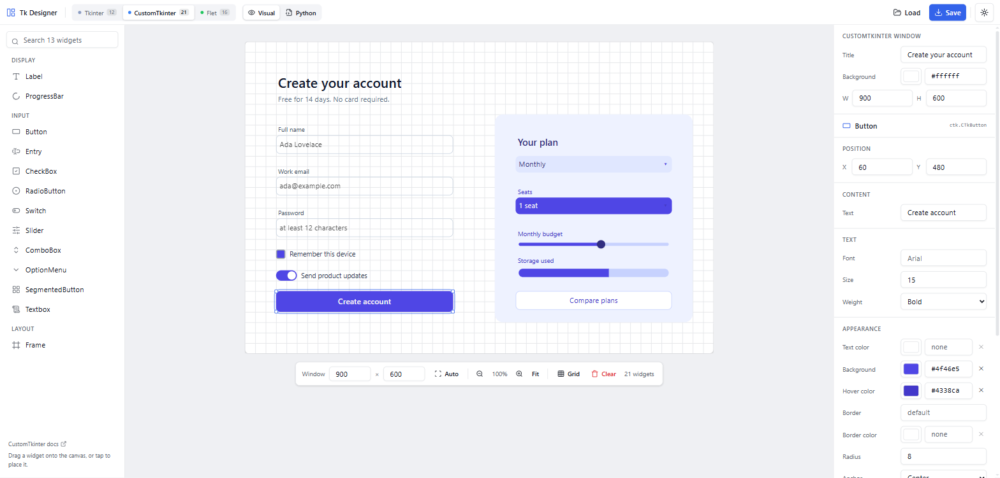
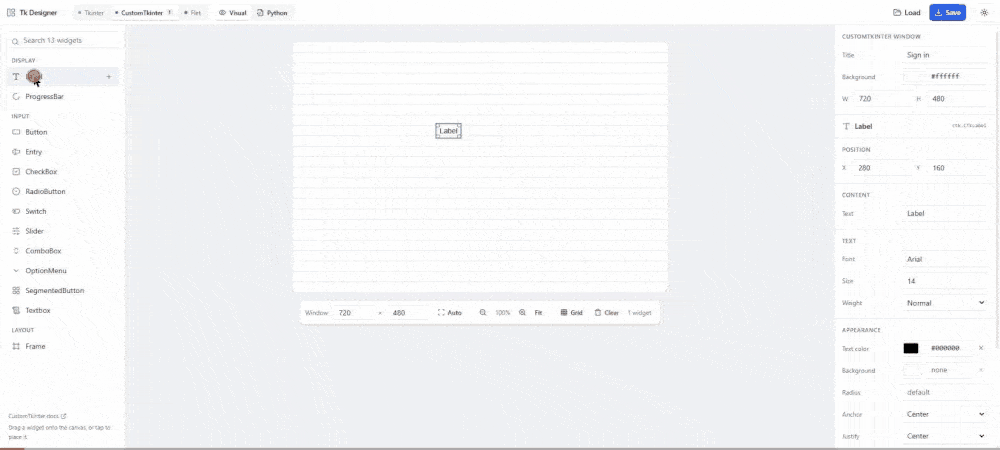
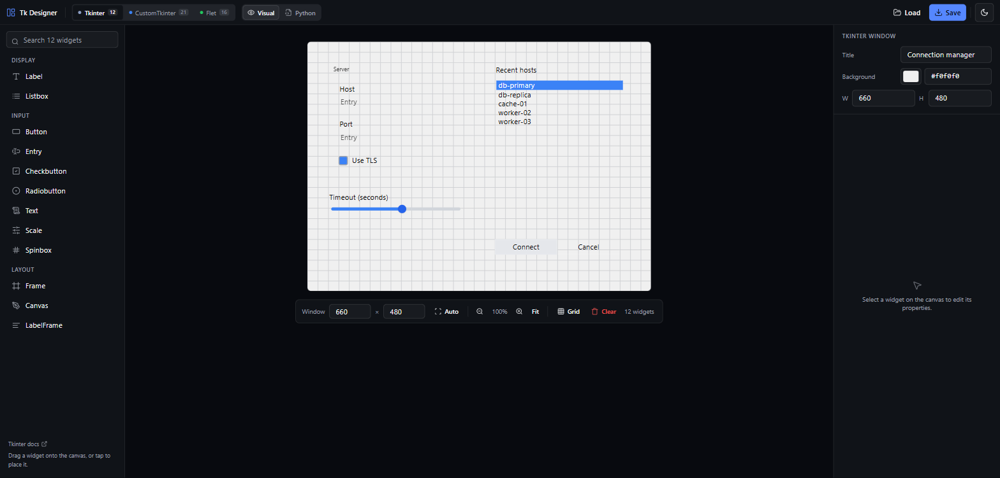
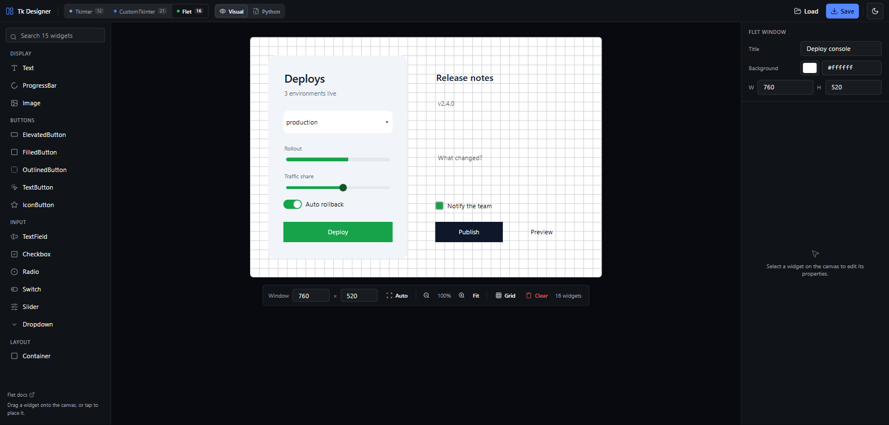
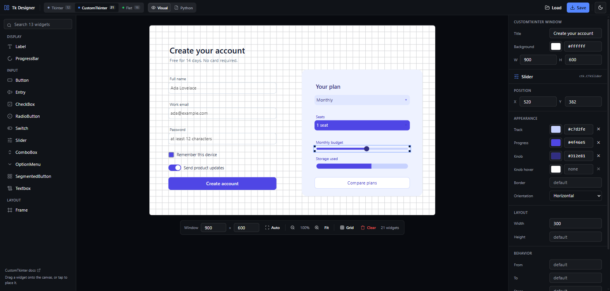
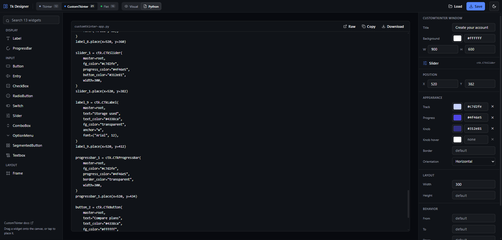
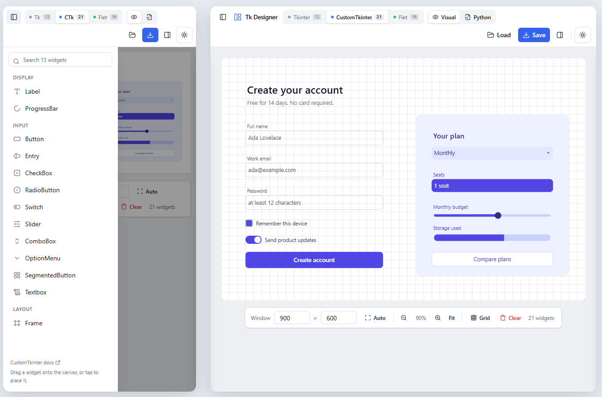

<div align="center">

# Tk Designer

**Draw your Python GUI, get runnable Python back.**

A visual builder for **Tkinter**, **CustomTkinter** and **Flet**. Drag widgets onto a canvas,
tune their properties, export a real `.py` file — then load that same file back and keep editing.

[](https://react.dev)
[](https://www.typescriptlang.org)
[](https://vite.dev)
[](https://tailwindcss.com)
[](#tests)
[](#no-server-no-account)
[](LICENSE)



</div>

---

## See it work

Add widgets, drag them into place, edit properties, read the generated Python — no reload, no round trip to a server.

<div align="center">
  
</div>

---

## Highlights

| | |
| --- | --- |
| **Three libraries, one editor** | Tkinter, CustomTkinter and Flet — each with its own widget catalogue, its own properties and its own canvas. |
| **Real Python, not a project file** | The export is ordinary, readable code you could have written by hand. No JSON hiding behind a `.py` extension. |
| **Round trips** | `Load` reads a generated file back into the canvas — widgets, order, positions, sizes, text, colours and fonts intact — and switches to the library the file is written in. |
| **Never executes your file** | Loading tokenises and pattern-matches a small Python subset. No `eval`, no `Function`, no network. |
| **Survives your own edits** | Statements outside the recognised subset are skipped, not fatal, so a file you have added logic to still opens. Anything skipped is reported in a toast. |
| **Live preview per library** | A `CTkSwitch` looks like a switch, a `CTkSlider` has a track and a knob, a `tk.Listbox` looks like a listbox, an `ft.Dropdown` looks like a dropdown — colours, fonts, radii and all. |
| **Autosaves locally** | Work is kept in `localStorage` and validated on read, so an old snapshot can never resurrect a widget or property the current build no longer knows. |
| **Light and dark** | The whole editor follows your theme; the designed window keeps its own background, exactly as your app will render it. |

---

## Quick start

```bash
npm install
npm run dev        # http://localhost:5173
```

| Command | What it does |
| --- | --- |
| `npm run dev` | Vite dev server with HMR |
| `npm run build` | Type-check and build static output into `dist/` |
| `npm run preview` | Serve the production build locally |
| `npm run lint` | ESLint over the whole project |
| `npm test` | Run the test suite once (`npm run test:watch` to iterate) |

Then run what you export:

```bash
pip install customtkinter     # or: flet   (tkinter ships with Python)
python customtkinter-app.py
```

### No server, no account

Everything runs in the browser. There is no API, no database and no login, so the build is a folder of
static files that deploys anywhere — Vercel, Netlify, GitHub Pages, an S3 bucket, `python -m http.server`.

---

## Three libraries, three documents

The picker in the header switches libraries. Each keeps **its own canvas**, so switching back and forth never
costs you work, and each offers only the widgets and properties that actually exist in that library.

| Library | Widgets | Positioning | Sizes |
| --- | :---: | --- | --- |
| **Tkinter** | 12 | `.place(x=, y=)` | text widgets in characters/lines, containers in pixels |
| **CustomTkinter** | 13 | `.place(x=, y=)` | pixels |
| **Flet** | 15 | `left=` / `top=` inside an `ft.Stack` | pixels |

<table>
<tr>
<td width="50%"></td>
<td width="50%"></td>
</tr>
<tr>
<td align="center"><code>tkinter</code> — classic Tk widgets, sized in characters</td>
<td align="center"><code>flet</code> — Material controls positioned in a Stack</td>
</tr>
</table>

Properties are per library too: Tkinter offers `relief` and `borderwidth`, CustomTkinter offers `corner_radius`
and `hover_color`, Flet offers `opacity`, `tooltip` and enum values written the idiomatic way
(`ft.Icons.SAVE`, `ft.FontWeight.BOLD`).

<details>
<summary><b>Full widget list</b></summary>

**Tkinter** — `Label`, `Button`, `Entry`, `Checkbutton`, `Radiobutton`, `Listbox`, `Text`, `Scale`, `Spinbox`, `Frame`, `Canvas`, `LabelFrame`

**CustomTkinter** — `CTkLabel`, `CTkButton`, `CTkEntry`, `CTkCheckBox`, `CTkRadioButton`, `CTkSwitch`, `CTkSlider`, `CTkProgressBar`, `CTkComboBox`, `CTkOptionMenu`, `CTkSegmentedButton`, `CTkTextbox`, `CTkFrame`

**Flet** — `Text`, `ElevatedButton`, `FilledButton`, `OutlinedButton`, `TextButton`, `IconButton`, `TextField`, `Checkbox`, `Radio`, `Switch`, `Slider`, `ProgressBar`, `Dropdown`, `Container`, `Image`

</details>

---

## Canvas, window size and zoom



- **The window is the artboard.** Whatever size you set is what lands in `root.geometry()` or `page.window.width`.
- **A new project fits your screen** — 75% of the viewport, snapped to the 20px grid and clamped to 640–1920 × 480–1200. `Auto` recomputes it at any time; the two number fields set an exact size.
- **Zoom is a view setting only.** `Fit` follows the space available and the controls override it between 25% and 200%. Positions, sizes and generated code stay in real pixels no matter what you are looking at.
- **The grid is 20px** and can be toggled off; dragging snaps to it, arrow keys step by it.

---

## Python in, Python out

`Save` generates a script for the current library and hands it to the browser as a download.
`Load` reads a `.py` file back into the canvas and **switches to the library the file is written in**,
detected from its imports and constructors.



<table>
<tr><th>CustomTkinter</th><th>Flet</th></tr>
<tr>
<td valign="top">

```python
import tkinter as tk
import customtkinter as ctk

root = ctk.CTk()
root.title("Create your account")
root.geometry("900x600")
root.configure(fg_color="#ffffff")


def on_button_click():
    print("button clicked")

button_1 = ctk.CTkButton(
    master=root,
    text="Create account",
    fg_color="#4f46e5",
    hover_color="#4338ca",
    corner_radius=8,
    width=340,
    height=40,
    font=("Arial", 15, "bold"),
    command=on_button_click,
)
button_1.place(x=60, y=480)

root.mainloop()
```

</td>
<td valign="top">

```python
import flet as ft


def main(page: ft.Page):
    page.title = "Deploy console"
    page.bgcolor = "#ffffff"
    page.window.width = 760
    page.window.height = 520

    def on_button_click(e):
        print("button clicked")

    filled_button_1 = ft.FilledButton(
        text="Deploy",
        icon=ft.Icons.ROCKET_LAUNCH,
        color="#052e16",
        bgcolor="#16a34a",
        width=236,
        height=44,
        on_click=on_button_click,
        left=72,
        top=400,
    )

    page.add(
        ft.Stack(
            width=760,
            height=520,
            controls=[filled_button_1],
        )
    )
    page.update()


if __name__ == "__main__":
    ft.run(main)
```

</td>
</tr>
</table>

Tkinter emits the same shape — plus the follow-up calls a widget needs, such as filling a listbox:

```python
listbox_1 = tk.Listbox(
    master=root,
    selectbackground="#3b82f6",
    width=28,
    height=8,
    font=("Arial", 12),
)
listbox_1.place(x=360, y=72)
listbox_1.insert(0, "db-primary")
listbox_1.insert(1, "db-replica")
listbox_1.insert(2, "cache-01")
```

The code is derived from state with `useMemo` and never stored beside it, so the canvas and the `Python`
tab cannot drift apart. In that tab you can **copy** it, **download** it, or open the **raw** text in a new tab.

### Loading is a parser, not an interpreter

`lexer.ts` tokenises a small Python subset with size and token caps, and `parse.ts` matches statements it
recognises: assignments, method calls, attribute assignments and `.place()` calls. Anything else — including
an argument it cannot read, such as a `lambda` — is skipped and reported, never executed.

Because the generator and the parser both read one widget catalogue, `editor → .py → editor` is a genuine
round trip. Widget ids are internal and are regenerated on load.

---

## Keyboard and pointer

| Action | How |
| --- | --- |
| Add a widget | Drag it from the palette, or **click** it to drop it on the canvas |
| Move | Drag on the canvas, or set exact **X / Y** in the panel |
| Nudge | <kbd>←</kbd> <kbd>↑</kbd> <kbd>↓</kbd> <kbd>→</kbd> by one grid step, <kbd>Shift</kbd> + arrow by one pixel |
| Duplicate | <kbd>Ctrl</kbd>/<kbd>⌘</kbd> + <kbd>D</kbd> |
| Delete | <kbd>Delete</kbd> or <kbd>Backspace</kbd> |
| Deselect / close drawers | <kbd>Esc</kbd> |
| Find a widget | The palette search box matches label and constructor (`CTkButton`, `ft.Text`, …) |

---

## Works on any screen

Below 1024px the palette and the properties panel become drawers, opened from the two panel buttons in the
header and closed by tapping the backdrop or pressing <kbd>Esc</kbd>; the header wraps and drops to short
library names. HTML5 drag-and-drop does not exist on touch devices, so **tapping a widget in the palette
places it**, and a placed widget is moved with the arrow keys or the X/Y fields.

<div align="center">
  
</div>

---

## How it is built

**Widgets are data, not code.** `src/frameworks/{tkinter,customtkinter,flet}.ts` each export a `FrameworkDef`
whose `widgets: WidgetDef[]` carry everything the rest of the app needs: the constructor, the variable prefix,
the palette icon and category, the `PropSpec[]`, optional fixed kwargs, an optional font composite, and a
`visual` map that tells the renderer which prop supplies the text, background, border and size.

> **Adding a widget or a property means editing one file.** The palette, the properties panel, the generator,
> the parser and the canvas preview all read the same definitions — and the round-trip test picks it up
> automatically.

A few `PropSpec` flags worth knowing:

| Flag | Meaning |
| --- | --- |
| `virtual` | Edited in the panel but not emitted as a kwarg — consumed by the `font` composite or by an `after` hook (e.g. Tkinter `Listbox.items`). |
| `transparentValue` | When the value is cleared, emit this literal instead of dropping the kwarg (CustomTkinter's `"transparent"`); the parser maps it back, so the absence *is* the value and it round-trips. |
| `enumPrefix` | Emit an identifier rather than a string (`ft.Icons.SAVE`); the parser accepts either form. |
| `itemCtor` | A list emitted as wrapped calls (`ft.dropdown.Option("A")`). |

**One document per library.** `EditorState` is `{ framework, docs }`, where `docs` holds a `FrameworkDoc` per
library. Every reducer case except `setFramework`/`load` goes through a `withDoc` helper, so an action can only
ever touch the active document.

**One place for state.** All mutations go through `editorReducer.ts`, which is also the only place coordinates
are clamped — dragging and the properties panel dispatch through it, so there is a single coordinate system.

**One renderer.** `WidgetPreview.tsx` draws every widget of every library from `WidgetDef.visual`, and both the
canvas and the drag ghost go through it, so they cannot diverge.

### Project layout

```text
src/
  types.ts              Component, FrameworkDoc, EditorState — one document per library
  frameworks/
    types.ts            PropSpec and WidgetDef — what a widget and a property are
    props.ts            builders for property specs
    tkinter.ts          the three catalogues: widgets, properties, defaults,
    customtkinter.ts    palette icon, constructor and preview mapping
    flet.ts
    index.ts            registry and lookup helpers
  lib/
    viewport.ts         the window size a new project starts at
    color.ts            luminance helpers for readable previews
  state/
    editorReducer.ts    every state change, including coordinate clamping
    persist.ts          localStorage autosave, validated on read
  codegen/
    python.ts           Python literal escaping
    generate.ts         EditorState -> Python (one emitter per library)
    lexer.ts            Python literal tokeniser
    parse.ts            Python -> EditorState, including library detection
  components/           canvas, palette, properties panel, shadcn/ui primitives
```

---

## Tests

```bash
npm test
```

The suite is the safety net for the hand-written parser: escaping rules, parser tolerance of foreign code,
library detection, the window size a new project starts at, and the `editor → .py → editor` round trip run
over **every widget of all three libraries** (`describe.each(FRAMEWORK_IDS)`, compared on a canonical form
that drops ids and undefined props).

A new widget or property is covered by that loop the moment it is added, and a regression in the generator
shows up as a failing round trip rather than as a corrupted project someone opens a week later.

---

## Stack

React 19 · TypeScript (strict) · Vite 6 · Tailwind v4 (`@theme` in `src/index.css`, no config file) ·
shadcn/ui "new-york" on Radix · react-dnd · lucide-react · sonner · Vitest

---

## License

[MIT](LICENSE) © shapikkk.

The Python you export is yours — nothing in this project claims any rights over the generated code.
Tkinter, [CustomTkinter](https://github.com/TomSchimansky/CustomTkinter) and [Flet](https://github.com/flet-dev/flet)
are separate projects under their own licenses.
